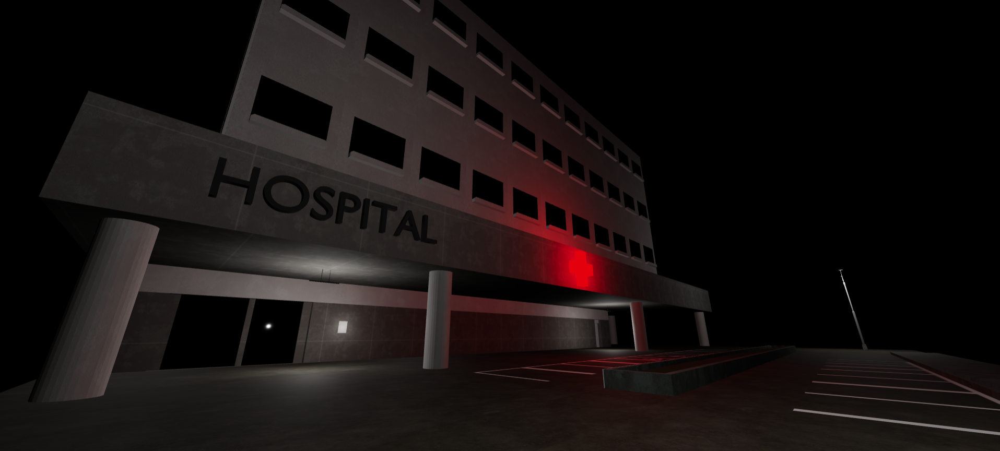
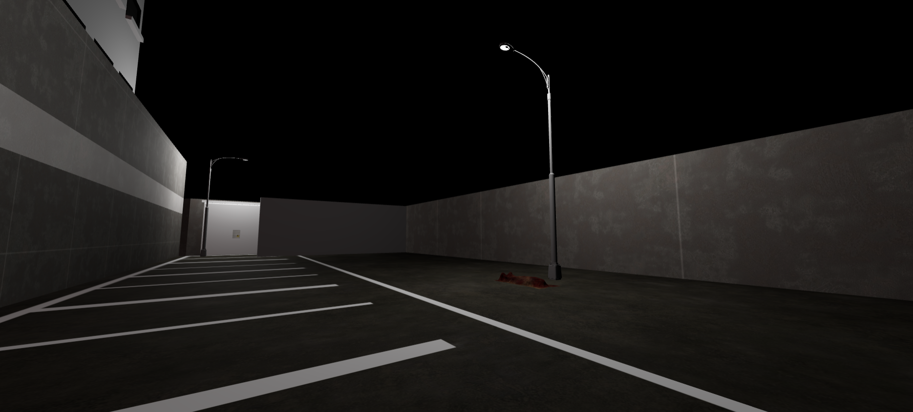
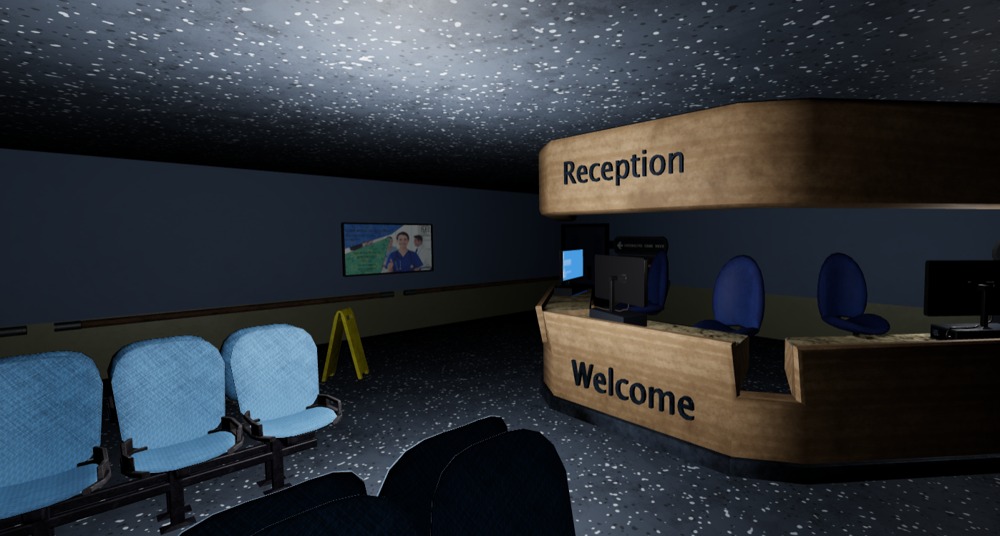
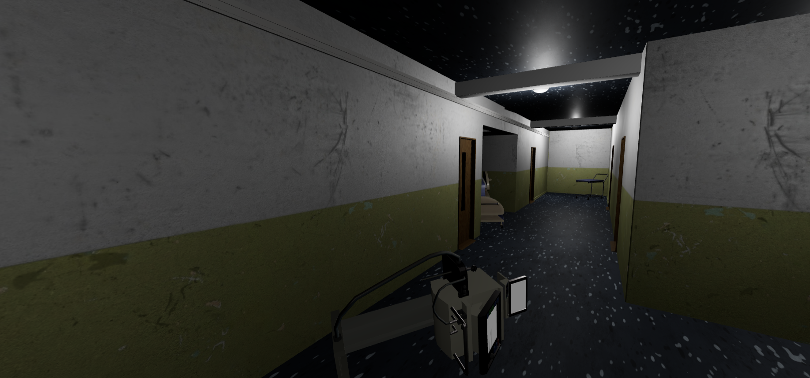
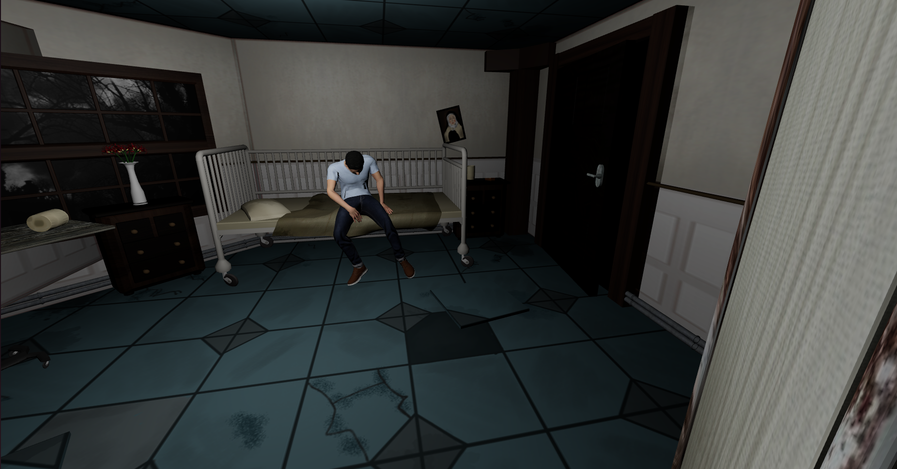

# Link to play the game
https://axelcodron.github.io/RAUG-Cahet-Codron/

# Authors
Enora Cahet: Interior gameplay and design.

Axel Codron: Base setup, exterior gameplay and design.

# Plot
**⚠️ Even if the graphics are simple, this is a horror themed game ⚠️**

You arrive at an hospital looking for your little brother who didn't come back. However, you found no one there, except for strange creatures...

# Controls
Use ZQSD or WASD to move, E to interact, and space to progress in dialogues.

# Photos of gameplay

# Copyrights
This game is based from the "fps" example of the three.js official website by mrdoob:
https://threejs.org/examples/?q=fps#games_fps

## Fonts
ZOMBIE font by Patrick Broderick.

## Images
Produced by the authors of this project: Enora Cahet and Axel Codron.

## Models
All used models are from Sketchfab.

### Exterior
Hospital exterior: https://skfb.ly/oKpXu
Lampost: https://skfb.ly/oVt6A
Ceiling lamp: https://skfb.ly/ouOVD
Corpse: https://skfb.ly/ooAnK
Paper: https://skfb.ly/6WOZU
Post it: https://skfb.ly/oFrKV
Infected (moving): https://skfb.ly/6BKSF
Locker: https://skfb.ly/6xGqV
Tablet folder: https://skfb.ly/6Sw8z

### Reception
Reception: https://skfb.ly/oG98U
Drawer: https://skfb.ly/6TXRV

### Corridor
Corridor: https://skfb.ly/6TTqv
Infected (idle): https://skfb.ly/oDLzO
Supplies: https://skfb.ly/oBGIT

### Room
Room: https://skfb.ly/oXRNU
Brother: https://skfb.ly/oQnnK

## Musics
Background exterior music by szegvaria from Pixabay:
https://pixabay.com/fr/users/szegvaria-9048476/?utm_source=link-attribution&utm_medium=referral&utm_campaign=music&utm_content=9237
Meeting your brother music by Tomomi Kato from Pixabay:
https://pixabay.com/music//?utm_source=link-attribution&utm_medium=referral&utm_campaign=music&utm_content=248712

## Sound effects
Bite scare effect by Pixabay:
https://pixabay.com/sound-effects/?utm_source=link-attribution&utm_medium=referral&utm_campaign=music&utm_content=47561
Shepard tone by Pixabay:
https://pixabay.com/sound-effects/?utm_source=link-attribution&utm_medium=referral&utm_campaign=music&utm_content=59283
Scary violins by Pixabay:
https://pixabay.com/sound-effects/?utm_source=link-attribution&utm_medium=referral&utm_campaign=music&utm_content=59283
Moving Zombie by Pixabay:
https://pixabay.com/sound-effects/?utm_source=link-attribution&utm_medium=referral&utm_campaign=music&utm_content=22336
Zombie bite by Pixabay:
https://pixabay.com/?utm_source=link-attribution&utm_medium=referral&utm_campaign=music&utm_content=96528
Paper noise by u_go9pkxdnu9 from Pixabay:
https://pixabay.com/sound-effects//?utm_source=link-attribution&utm_medium=referral&utm_campaign=music&utm_content=245786
Door noise by Pixabay:
https://pixabay.com/?utm_source=link-attribution&utm_medium=referral&utm_campaign=music&utm_content=44280
Locked Door noise by Pixabay:
https://pixabay.com/sound-effects/?utm_source=link-attribution&utm_medium=referral&utm_campaign=music&utm_content=79921
Bag noise by Pixabay:
https://pixabay.com/?utm_source=link-attribution&utm_medium=referral&utm_campaign=music&utm_content=95101
Footsteps by Pixabay:
https://pixabay.com/?utm_source=link-attribution&utm_medium=referral&utm_campaign=music&utm_content=39202
Lamp noise by Pixabay:
https://pixabay.com/sound-effects/?utm_source=link-attribution&utm_medium=referral&utm_campaign=music&utm_content=17625

# Help if you are stuck
**Warning! This is a spoiler for the first puzzle of the game!**

First number is the hour corresponding to the first appearance of the stiff rigidity: 2.

Second number are the initials of Terry, check the paper next to the hospital entrance: 2.

Last two numbers are the version of the covid in the game, check the paper next to the hospital entrance: 31.